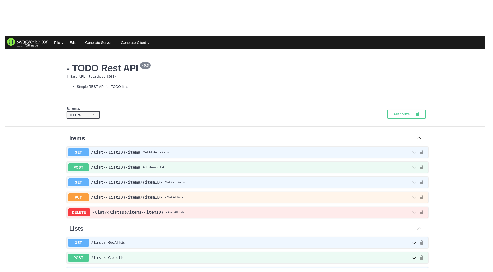

## **REST API для работы с TODO списками**
____________________________________________________________________________
_Данный проект разработан исключительно как пример кода для портфолио_
_____________________________________________________________________________
Используемый стек технологий:

- Go 1.16
- Mongo DB
____________________________________________________________________________________
### Описание проекта:

Данный проект представляет собой API для работы с TODO списками.
Он предоставляет возможность пользователю создавать, изменять, удалять и просматривать списки,
внутри которых содержаться элементы, представляющие собой определенную задачу с пометкой выполнено либо нет.
Таким образом API предоставляет возможность пользователям вести список задач с удобным их разделением по группам.

В приложении реализованна аутентификация пользователей при помощи JWT-токенов с методом подписи HS256

В качестве роутера использована библиотека mux.

В качестве базы данных используется MongoDB - не реляционная СУБД,
взаимодействие с которой осуществляется при помощи официального драйвера mongo для языка Go

Пароли в базе хранятся в зашифрованном виде (Используется хеширование SHA1)

Для логирования используется библиотека logrus

Настройка API производится при помощи конфигурационного файла в формате toml, находящегося в директории configs 

___________________________________________________________________________________
### Конфигурация
Схема конфигурационного файла config.toml

#### [server] - Эта группа содержит настройки сервера
    port - порт, на котором будет работать приложение
#### [database] - Эта группа содержит настройки базы данных
    connection_string - строка подключения к бд
    database_name - имя базы данных, в которой будет хранится вся информация приложения
#### [jwt] - Настройки jwt токенов, используемых для аутентификации пользователей
    Key - секретный ключ, используемый для подписи токенов (необходимо хранить в тайне)
#### [logs] - Настройки логирования 
    log_level - уровень логирования**. Может быть Trace, Debug, Info, Warning, Error, Fatal и Panic

** Более подробно об уровнях логирования вы можете узнать в репозитории проекта logrus

___________________________________________________________________________________
### Документация
У API есть документация в swagger. Документы с описанием api вы можете найти в папке docs. 
Она содержит два файла в формате json и yaml. Вы можете использовать любой из них,
чтобы просмотреть документацию при помощи проекта swagger. Документация содержит информацию обо всех хендлерах, 
списках бизнес-сущностей, структурах запросов и ответов, т.е. всю информацию, необходимую для реализации клиента:

_______________________________________________________________________________________
###  Начало работы:

####Сборка и запуск:
Для сборки и запуска проекта используйте следующие команды:

    $ make build
    $ ./main 

